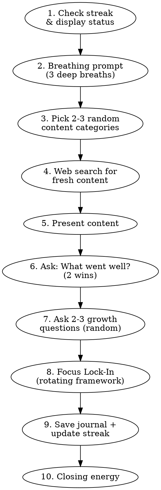

# /vibes — Positive Mindset Priming

A research-backed, under-5-minute launch sequence that primes focus, gratitude, and creative energy before coding. Uses live web search for fresh content every run.

**Core principle:** Prime, not distract. This is a launch sequence, not a meditation app.

**Optional argument:** $ARGUMENTS — mood or focus hint (e.g., "low energy", "stressed", "fired up")

## Flow

Follow this flow EXACTLY. Do not skip steps or combine them.



## Step 1: Check Streak

Read `~/.claude/vibes/streak.json`. If it doesn't exist, initialize:

```json
{ "currentStreak": 0, "longestStreak": 0, "lastRunDate": "", "totalRuns": 0, "lastFrameworks": [], "focusFrameworkCounts": { "A": 0, "B": 0, "C": 0, "D": 0, "E": 0 } }
```

Calculate streak status:
- If `lastRunDate` was yesterday: increment `currentStreak`
- If `lastRunDate` was today: already ran today (show streak, skip increment)
- Otherwise: reset `currentStreak` to 1 (new streak starts today)
- Update `longestStreak` if current exceeds it
- Increment `totalRuns`

Display streak with visual fire. Celebrate milestones at 7, 14, 30, 60, 100 days.

## Step 2: Breathing Prompt

Display this exactly:

```
Take 3 slow, deep breaths. In through the nose, out through the mouth.

  Breathe in... 2... 3... 4...
  Hold... 2... 3... 4...
  Breathe out... 2... 3... 4... 5... 6...

  (Repeat 2 more times, then continue when ready)
```

This activates vagal tone and primes alpha/theta brain states (Nature 2025). Do NOT skip this step.

## Step 3: Pick Content Categories

Randomly select 2-3 from this pool (never the same combination two runs in a row if possible):

1. **Inspiration** — Motivational quote from a leader, athlete, philosopher, or thinker
2. **Humor** — Funny joke, standup bit, comedian quote, or funny anime moment
3. **Discovery** — Fresh positive psychology research or inspiring real-world story
4. **Reframe** — Stress reappraisal prompt that turns current friction into fuel
5. **Brain Teaser** — Lateral thinking puzzle or riddle for cognitive flexibility
6. **Flow Fuel** — Music recommendation (60-70 BPM ambient/instrumental) for the session
7. **Focus** — Fresh focus/attention research, deep work tactics, or flow state science

If `$ARGUMENTS` mentions mood (e.g., "stressed", "low energy", "hyped"), bias category selection:
- Stressed/anxious → prefer Reframe + Humor
- Low energy → prefer Inspiration + Flow Fuel
- Hyped/fired up → prefer Brain Teaser + Discovery
- Distracted/unfocused → prefer Focus + Reframe

## Step 4: Web Search

For EACH selected category, use web search to find FRESH content. Prefer Firecrawl if available, fall back to WebSearch. Do NOT use canned quotes from your training data. If a search returns zero useful results, acknowledge the miss and move on — never fabricate content to fill the gap.

**Search strategies by category:**

| Category | Search Query Examples |
|----------|---------------------|
| Inspiration | "inspiring quote [random philosopher/athlete/leader]", "motivational wisdom [topic]" |
| Humor | "funny standup bit [comedian name]", "hilarious anime moment", "best one-liner jokes" |
| Discovery | "positive psychology research 2025 2026", "inspiring story overcoming adversity recent" |
| Reframe | "stress reappraisal technique", "cognitive reframing examples" |
| Brain Teaser | "lateral thinking puzzle", "creative riddle", "logic puzzle short" |
| Flow Fuel | "ambient music playlist focus coding", "lo-fi instrumental album 60 BPM" |
| Focus | "evidence-based focus technique 2025 2026", "neuroscience attention method", "deep work strategy [Newport/Csikszentmihalyi]" |

Vary your search terms each run. Pull from different sources. The whole point is SURPRISE and FRESHNESS.

## Step 5: Present Content INTERACTIVELY

Present each category one at a time. After each one, engage the user with an interactive prompt before moving to the next. This is a conversation, not a presentation.

Start with the header:
```
VIBES CHECK — [Date] | Streak: [N] days
```

Then present each category with its interactive follow-up:

**Per-category interaction rules:**

| Category | Present | Then Ask (via AskUserQuestion) |
|----------|---------|-------------------------------|
| Inspiration | Show the quote with attribution | "Inspired by that — what's YOUR quote for the day? One sentence, your own words." |
| Humor | Show the joke/bit (no punchline spoiler if possible) | For jokes with answers: ask the riddle, wait for their guess, then reveal + react comedically. For standup bits: "What's something that made YOU laugh recently?" |
| Discovery | Share the research finding | "Does this connect to anything in your life or work right now?" |
| Reframe | Present the reframing technique | "What's something stressing you right now? Let's reframe it together." |
| Brain Teaser | Ask the puzzle as a QUESTION only — do NOT reveal the answer | Wait for their answer via AskUserQuestion. Then respond: if correct, celebrate big. If wrong, reveal with humor and encouragement. Either way, make it fun. |
| Flow Fuel | Share the music recommendation | "Does this vibe match your session energy, or do you want something different?" |
| Focus | Share the focus research | "How could you apply this to your next 90 minutes?" |

**Key rules:**
- NEVER dump all content at once. One category → interact → next category.
- Brain Teasers: NEVER show the answer with the question. Always ask first, wait, then react.
- Humor: Be genuinely funny in your responses. Play off their energy. Riff.
- Keep each interaction to 1-2 exchanges. This is priming, not a workshop.

Do NOT use generic programming jokes from training data. Do NOT fabricate "research." Everything must come from the web search.

## Step 6: What Went Well

Ask the user using AskUserQuestion:

> "What are 2 things that went well recently? Could be code wins, personal wins, anything."

Wait for their response. Save it for the journal.

## Step 7: Growth Questions

Pick 2-3 randomly from this pool. Use AskUserQuestion for structured input:

**Gratitude & Wins:**
- What's something small you're grateful for right now?
- Who helped you recently that you haven't thanked?

**Energy & State:**
- Energy level today? (1-10)
- What's one thing draining your energy that you can let go of?
- What's exciting you about today's work?

**Growth & Intention:**
- What's ONE skill you're actively improving?
- What's a mistake you made recently that taught you something?
- If you could only accomplish one thing today, what would matter most?

**Mindset & Reframe:**
- What's something frustrating you? How could it be a gift?
- What would you attempt if you knew you couldn't fail?
- What's a belief you held last year that you've outgrown?

**Impact & Connection:**
- How does today's work help someone else?
- What's one way you could make someone's day better?
- What legacy does this project contribute to?

## Step 8: Focus Lock-In (50 sec)

This step uses a **rotating focus framework** — one per run, cycling across sessions. Each framework is a micro-commitment that primes your brain for deep work, not a planning session.

Read `lastFrameworks` from `~/.claude/vibes/streak.json`. Pick the next framework in rotation (A→B→C→D→E→A), skipping any that appeared in the last 2 runs. If `$ARGUMENTS` mentions "stressed", bias toward Framework B (WOOP handles obstacles well).

### Framework A: MIT + If-Then (20 sec)

Ask using AskUserQuestion:

> "What's the ONE most important thing you'll accomplish today?"

Then:

> "Now name one distraction that usually pulls you off track. Complete this: If [that distraction happens], then I will [your response]."

*Science: Implementation intentions reduce goal-related distractions by 60% (Gollwitzer). vmPFC activates stronger when committing to a single goal (Duckworth 2024 fMRI).*

### Framework B: WOOP Mental Contrasting (20 sec)

Ask 4 quick prompts using AskUserQuestion:

> "**Wish:** What's your ideal outcome for this session?
> **Outcome:** If you nailed it, what would that feel like?
> **Obstacle:** What's ONE thing that might derail you?
> **Plan:** How will you handle it when it hits?"

*Science: WOOP increases goal completion 2x vs. information-only (2024 VA study). Works because it energizes motivation and pre-solves obstacles.*

### Framework C: Attention Anchor + MIT (15 sec)

Ask:

> "Pick ONE focus word for your session — could be 'precision', 'momentum', 'clarity', 'patience', 'craft', or anything that resonates. Then: what's the ONE thing you're building toward today?"

*Science: Focus anchors activate the dorsal attention network (goal-directed) and down-regulate the ventral attention network (novelty-seeking).*

### Framework D: Distraction Defense (15 sec)

Ask:

> "Name ONE thing that usually distracts you during focus work. Now complete this: If [that happens], I will [your planned response]. (Examples: write it down and ignore for 25 min, silence phone, take 3 breaths and return)"

*Science: Pre-commitment plans route decisions through prefrontal cortex (planning) instead of limbic system (impulse). Result: 40-60% fewer distractions.*

### Framework E: Simple Intention — Fallback (10 sec)

Ask:

> "What's your ONE intention for this session? Not a to-do list — one thing that would make this session feel successful."

*Use this on low-energy days when a structured framework feels like too much. The other frameworks are better — this is the escape hatch, not the default.*

## Step 9: Save Journal & Update Streak

Create directory if needed: `mkdir -p ~/.claude/vibes/journal`

Write journal entry to `~/.claude/vibes/journal/YYYY-MM-DD.md`:

```markdown
# Vibes — [Month Day, Year] | Streak: [N]

## What Went Well
- [Win 1]
- [Win 2]

## Today's Content
- **[Category]:** [Brief summary of content shared]
- **[Category]:** [Brief summary]

## Growth Check-in
- [Question]: [Answer]
- [Question]: [Answer]

## Focus Commitment
**Framework:** [A/B/C/D/E — name]
- **MIT:** [Most Important Thing]
- [Framework-specific output: If-Then, WOOP summary, Anchor word, or Distraction plan]

## Session Intention
> [Their intention — from Framework E, or synthesized from A-D output]
```

Update `~/.claude/vibes/streak.json` with new values. Also update `lastFrameworks` (keep rolling window of last 3) and increment the used framework's count in `focusFrameworkCounts`.

## Step 10: Closing Energy

End with a short, energizing close. Match their energy — celebratory if they're hyped, grounded if they're reflective. NOT generic motivation — reference something specific from THIS session (their wins, their intention, the content shared).

Example pattern:
```
"You [reference their win]. You're aiming to [reference their intention].
The vibes are locked in. Let's build."
```

Keep it to 2-3 sentences. Then stop — the priming is done, time to work.

## Common Mistakes

| Mistake | Fix |
|---------|-----|
| Using canned quotes from training data | ALWAYS web search. Freshness is the whole point. |
| Skipping the breathing step | It's 30 seconds and scientifically backed. Do it. |
| Making the session too long | Under 5 minutes total. Prime, don't distract. |
| Generic affirmations ("You're amazing!") | Research shows these backfire. Use process-focused language. |
| Dumping all 7 categories at once | Pick 2-3 randomly. Rotation = surprise = engagement. |
| Not saving the journal | Persistence is what makes this a practice, not a gimmick. |
| Fabricating research results | If search fails, say so. Never make up "studies show..." |
| Turning Focus Lock-In into a planning session | 50 sec max. It's a micro-commitment, not a roadmap. |
| Using the same focus framework every run | Rotation prevents habituation. Check lastFrameworks in streak.json. |
